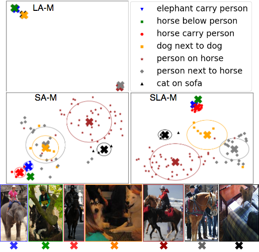

# Deeply Supervised Multimodal Attentional Translation Embeddings for Visual Relationship Detection

## Introduction

This code demonstrates the main key elements of the work "DEEPLY SUPERVISED MULTIMODAL ATTENTIONAL TRANSLATION EMBEDDINGS FOR VISUAL RELATIONSHIP DETECTION":
Detecting visual relationships, i.e. <Subject, Predicate, Object> triplets, is a challenging Scene Understanding task approached in the past via linguistic priors or spatial information in a single feature branch. We introduce a new deeply supervised two-branch architecture, the Multimodal Attentional Translation Embeddings, where the visual features of each branch are driven by a multimodal attentional mechanism that exploits spatio-linguistic similarities in a low-dimensional space. We present a variety of experiments comparing against all related approaches in the literature.

## Basic dependencies

Python version: 3.5

Tested versions of important requirements:

* numpy==1.14.5
* torch==1.0.0
* torchvision==0.2.1

## To run this project

* Clone project and cd project folder
* Run script download_data.sh. This will download the VRD dataset (images and annotations) and merge the folders as necessary.
* Set the environment variables in config.yaml and run prepare_data.py. This will create all necessary files to perform training and/or testing of a model.
* Run main.py to train and test a Multimodal Attentional Embeddings model. The function will first check if a model exists and will train a new one if not. Then, testing on VRD test split is performed.

## Results
Due to stochastic procedures (random weight initialization, data shuffling), the results after training may vary; that is, one may get slightly better or slightly worse results. On our paper, we reported mean values after training 5 times:

| Recall@50 (k = 1) | Recall@50 (k = 70) | Recall@100 (k = 70) |
| -------------|-------------|-----|
| 56.14      | 89.79 | 96.26 |

## Qualitative Results

Interestingly, when visualizing each attentional module's outputs, we noticed that they learn to perform a clustering on a low-dimensional space:

We used t-SNE to visualize the projection space created by each
attentional module, for relationship 7 classes. Centroids and std ellipsoids are also
shown. Linguistic Attentional Module (LA-M) quantizes relationships based exclusively on subject
and object embeddings. Spatial Attentional Modulde (SA-M) generates weights that are highly-
dependent on the objects relative positions and sizes. Lastly, the proposed Spatio-Linguistic Attentional Module (SLA-M) exploits both
spatial and semantic features to create a space where different relationships are better separated, while preserving the desired similarities.
This observation opens a promising future direction for cross-modal embeddings.

## For further questions
nikos.gkanatsios93@gmail.com
